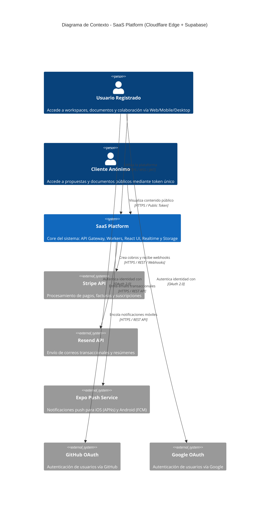
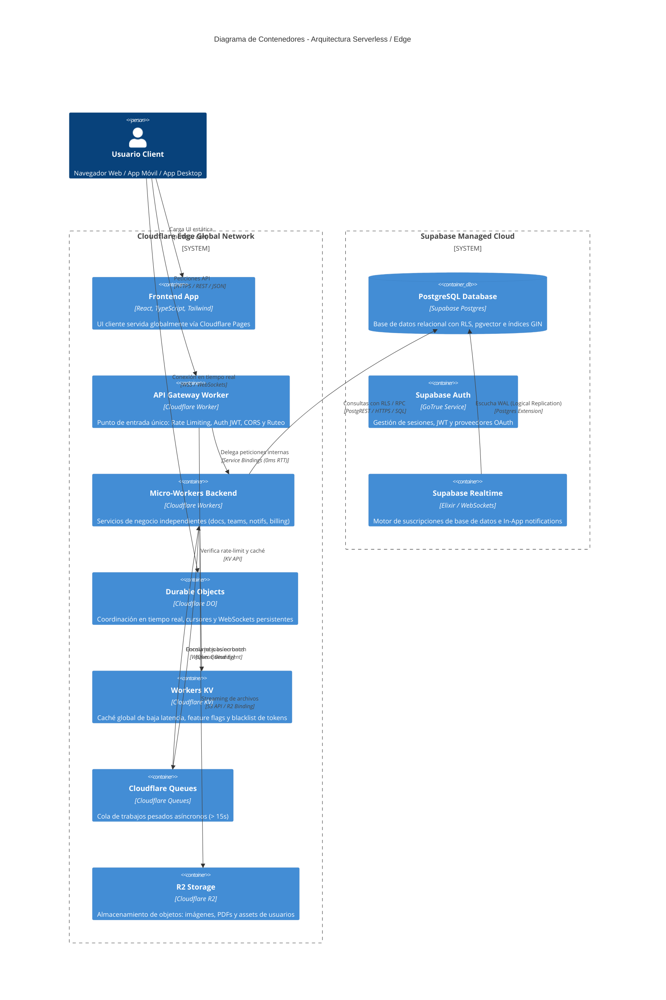
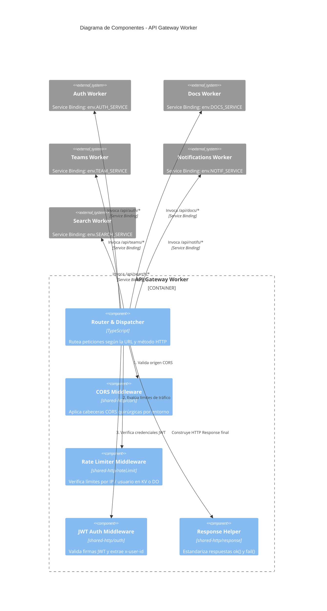
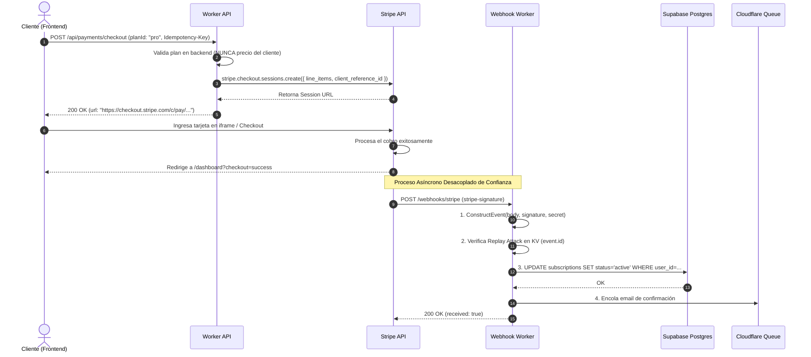
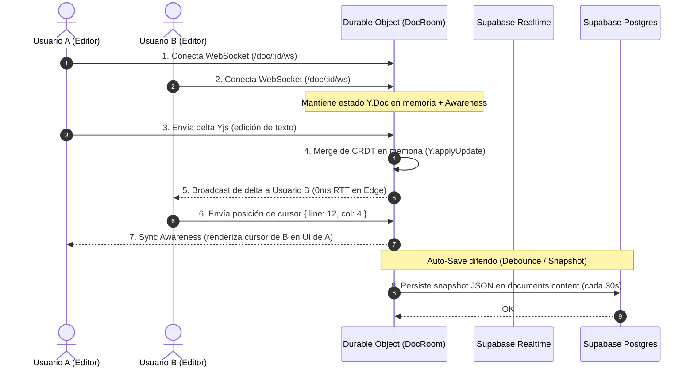

# MODELO C4 Y DIAGRAMACIÓN DE ARQUITECTURA

Este documento define la norma obligatoria para documentar la arquitectura visualmente usando el **modelo C4** y **Mermaid.js**. Los diagramas deben ser versionables en Git, legibles directamente en GitHub/Markdown y mantener coherencia con el stack **Cloudflare Workers + Supabase + React**.

---

## LAS 4 CAPAS DEL MODELO C4

```
Nivel 1: Contexto (System Context) ──→ Quién usa el sistema y qué sistemas externos se integran
Nivel 2: Contenedores (Container)   ──→ Apps desplegables, bases de datos y almacenamiento
Nivel 3: Componentes (Component)   ──→ Módulos internos de un Worker / servicio
Nivel 4: Código (Code)              ──→ UML / Flujos de clases (opcional para casos complejos)
```

---

## 1. DIAGRAMA C4 NIVEL 1: CONTEXTO DEL SISTEMA

Muestra el panorama general: cómo interactúan los usuarios (autenticados y anónimos) con la plataforma SaaS y con los servicios de terceros.

**[REQUIRED]** Todo nuevo sistema o producto debe incluir este diagrama en su documentación base.



---

## 2. DIAGRAMA C4 NIVEL 2: CONTENEDORES

Muestra las unidades de software desplegables, bases de datos y capas de almacenamiento en el Edge de Cloudflare y Supabase Cloud.



---

## 3. DIAGRAMA C4 NIVEL 3: COMPONENTES (API GATEWAY)

Desglosa el funcionamiento interno del contenedor **API Gateway Worker** y su interacción vía **Service Bindings** con los micro-workers especializados.



---

## 4. DIAGRAMAS DE SECUENCIA

### 4.1 Flujo de Pago y Suscripción (Stripe → Worker → Webhook → Supabase)

Muestra cómo se procesa un pago seguro garantizando que el usuario **nunca** active suscripciones desde el cliente frontend (`PAYMENTS_SECURITY_STANDARD.md`).



### 4.2 Flujo de Colaboración en Tiempo Real (WebSocket + Yjs + Durable Objects)

Demuestra cómo se sincronizan deltas CRDT y cursores múltiples entre colaboradores sin sobreescribir datos (`FRONTEND_CRDT_COLLABORATION.md`).



---

## 5. DIAGRAMA DE DESPLIEGUE (Deployment Architecture)

Ilustra la distribución física de la infraestructura en el Edge global de Cloudflare y la región de base de datos de Supabase.

```mermaid
deploymentDiagram
  title Diagrama de Despliegue Global - Cloudflare Edge + Supabase Region

  deploymentNode(user_device, "Dispositivo de Usuario", "Navegador Web / Mobile / Desktop") {
    node(browser, "Client Runtime (Vite/React)")
  }

  deploymentNode(cf_network, "Cloudflare Global Anycast Network (300+ Ciudades)", "Edge Infrastructure") {
    node(pages_cdn, "Cloudflare Pages", "Static Assets CDN")
    node(edge_worker, "Cloudflare Workers", "V8 Isolated Execution Contexts")
    node(edge_kv, "Cloudflare KV", "Distributed Key-Value Store")
    node(edge_r2, "Cloudflare R2", "S3-Compatible Object Store")
  }

  deploymentNode(aws_region, "Supabase Region (AWS us-east-1)", "Managed Cloud Provider") {
    node(pg_cluster, "PostgreSQL Cluster", "Primary DB + Read Replicas")
    node(gotrue, "GoTrue Auth Service", "OAuth & JWT Token Issuer")
  }

  browser -- pages_cdn : 1. Fetch HTML/JS/CSS (HTTP/3)
  browser -- edge_worker : 2. Peticiones API (HTTPS REST)
  edge_worker -- edge_kv : Read/Write Cache
  edge_worker -- edge_r2 : Streaming assets
  edge_worker -- pg_cluster : Connection Pooling (HTTPS / Transaction Mode)
  browser -- gotrue : Auth Tokens / Refresh
```

---

## HERRAMIENTAS Y REGLAS DE DOCUMENTACIÓN VISUAL

1. **Mermaid.js obligatorio:** Todos los diagramas del repositorio deben escribirse en bloque ```mermaid para permitir versionado Git en texto plano.
2. **Sin imágenes binarias sin fuente:** Queda prohibido subir diagramas PNG/JPG sin guardar el archivo fuente `.drawio` o `.excalidraw` en el mismo directorio.
3. **Mantenimiento en CI:** El pipeline de CI valida la sintaxis de todos los bloques Mermaid al ejecutar `npm run check`.
